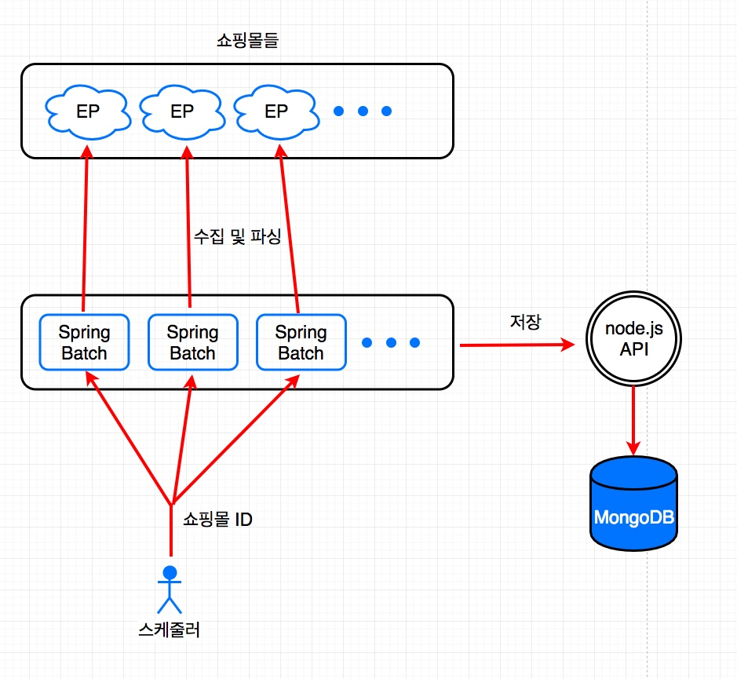
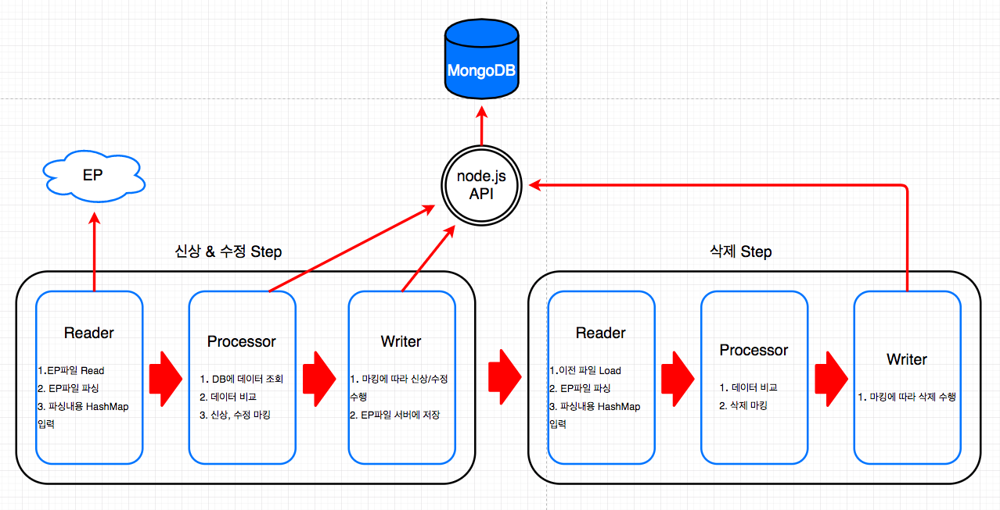

# Summer Campus Hackday - 박영환

## 주제
**쇼핑 상품정보 수신**
1. 각 쇼핑몰에서 네이버 쇼핑에 상품을 제공할 때에는 EP라는 파일에 탭을 구분자로 하여 제공한다.
2. 주기적으로 이 파일을 다운받고 파싱하여 데이터베이스에 Insert를 하는 프로젝트.
3. 그 과정에서 상품이 추가, 변경, 삭제 된 것을 구분.
4. 이 모든 과정을 보다 효율적으로 수행하기 위해 고민.

## 사용 기술

- Java
- Spring Batch
- Node.js + Express.js
- MongoDB

## 기술에 대한 사용 이유
**Spring Batch**
- 대용량의 데이터를 반복해서 읽는 작업이 목적인 프레임워크 이기에 배치 작업에 맞는 틀이 정해져 있어서 작업을 목적 별로 나누기 수월하다고 생각했습니다.
- Spring을 사용해보았기 때문에 보다 익숙하게 사용할 수 있다고 생각했습니다.
- 주 언어가 Java 이기에 사용하기 더 친숙 하였습니다.

**MongoDB**
- 널리 사용되는 NoSQL 데이터베이스라, 검색 할 자료가 많을 것이라고 생각하여 짧은 시간에 익히기 쉬울 것이라고 판단했습니다.
- 읽고 쓰는 작업이 많은 프로젝트이고 그에 대한 작업이 많아 해당 프로젝트에 적합하다고 생각했습니다.

-DB 선택 후, EP파일은 Header(데이터에 대한 필드)가 계속 바뀌고, Row의 길이가 계속 바뀔 수 있어, JSON으로 관리하여 유연한 컬럼을 지원하는 MongoDB가 적합한 데이터베이스라는 것을 알게 되었습니다.

**Node.js**
- 처음에는 프로젝트에서 몽고를 직접 쿼리 하려고 했지만, MongoDB는 Javascript를 이용해 쿼리 작업을 하였고, Spring Data에서 제공하는 MongoDB 라이브러리로는 javascript를 이용하는 장점을 살릴 수 없을 것 같았습니다. 그래서 편리하게 쿼리를 하고자 똑같은 javasciript인 node.js를 사용하기로 했습니다.

## 시스템 설계

## 핵데이로 인한 성과
- Spring Batch, Node.js, MongoDB 모두 처음 사용해보는 기술이었지만 비교적 짧은 시간에 주어진 요구사항에 맞게 동작하는 프로젝트를 만들었습니다.

- RDB에 저장 된 ShopId(쇼핑몰 id)로 사용자가 EP URL을 요청하여 각 쇼핑몰에 독립적인 배치를 만들어 여러개를 서버에 띄울 수 있습니다.

## 핵데이로 인한 성장
- EP문서와 같이 대용량의 동적인 컬럼을 사용할 수 있고, 자바스크립트로 쿼리를 하는 MongoDB에 대해 알게 되었습니다.
- node.js와 express.js를 사용하여 CRUD API를 만드는 방법을 알게 되었습니다.
- swagger를 사용하여 rest api의 문서를 편리하게 만드는 방법을 알게 되었습니다.
- Spring Batch를 익혔고, 이를 통해 배치의 각 단계 Read, Process, Write에 대해 알고, 이로 인해 배치의 개념에 대해 더 많이 이해 할 수 있었습니다.

이번 Naver Hack Day를 통해 사용해보지 않은 새로운 기술을 사용하여 색다른 경험을 할 수 있었고, 성장하는 계기가 될 수 있었습니다.
네이버에서 꾸준한 성장과 함께 제 꿈을 펼쳐보고 싶습니다.

감사합니다.
